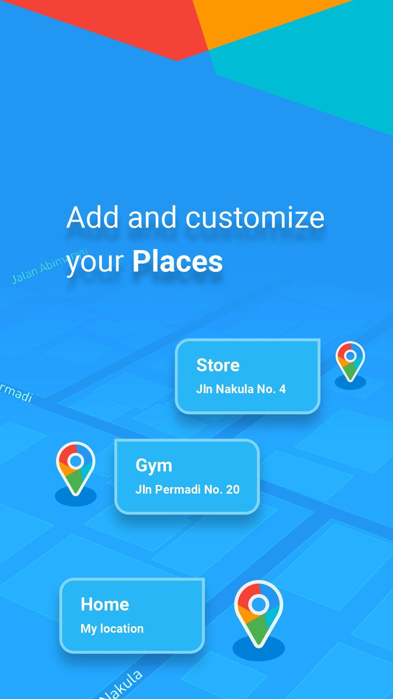
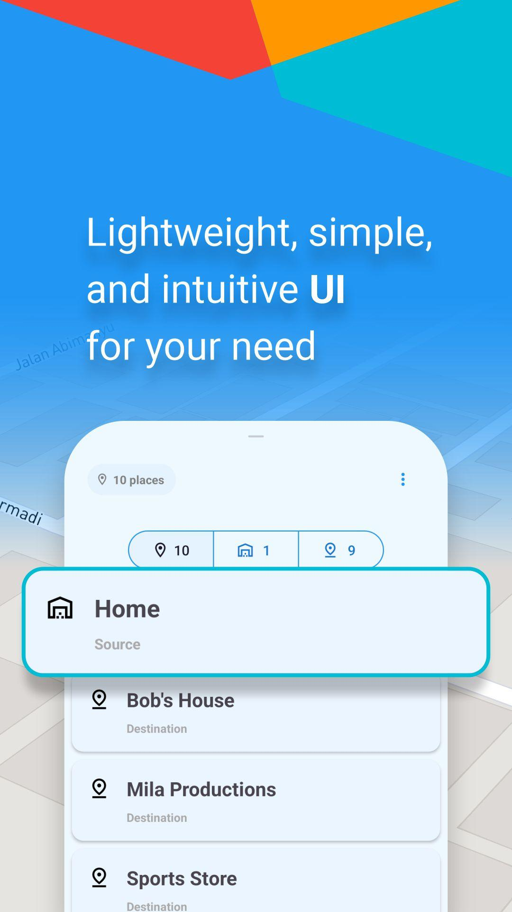
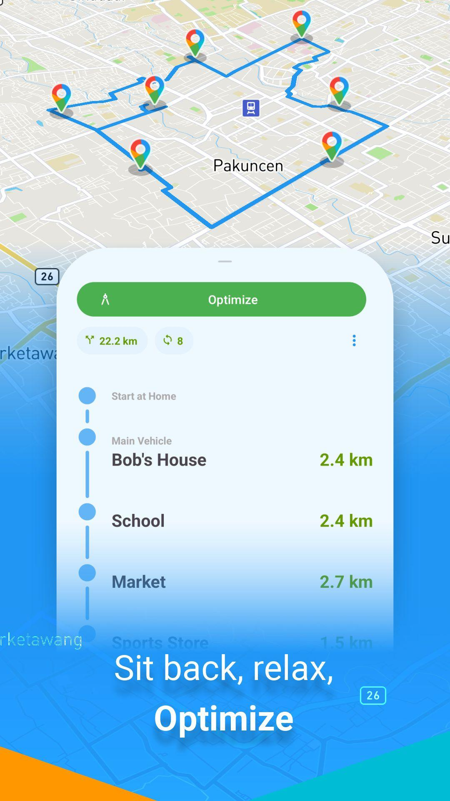

# RouteMate
RouteMate is an open-source all-in-one solution for any route optimization problems. Built for mobile on top of Android’s Java &amp; Kotlin.
[Official Website](https://konstelasi.co.id/software/routemate/)

  

## Description
Route optimization is a few clicks away! RouteMate is suitable for both beginner and expert users. Having difficulties finding the best route? RouteMate answers your problem.

## Features
- Generous places limit - Place as many as 12 locations on the maps for optimization
- Fleet management - Customize vehicles used in your fleet
- Optimization - Get the best route to begin a trip with
- Sync - Synchronize your data across all devices (sign-in required)
- Distance matrix - Edit each matrix element to improve precision further or recalculate the entire matrix

## Installation
### 1. Setting up Mapbox Access Token
- Sign in to [Mapbox](https://account.mapbox.com/)
- Copy the public access token from your dashboard. A public token may begin with the following letters
```
pk.
```

### 2. Setting up Google Maps Platform API Key
- Sign in to [Google Cloud](https://console.cloud.google.com/)
- Create a new project
- Go to Google Maps Platform > Credentials > Create Credentials > API Key
- Copy the API Key
- Optionally, you can restrict the API only for Distance Matrix API

### 3. Setting up Firebase
- Sign in to [Firebase Console](https://console.firebase.google.com/)
- Create a new project (optionally, you can link the previous Google Cloud project)
- Add an Android app and follow the instructions carefully (setup instructions are provided by Firebase)
- Download the `google-services.json` file and place it in the `app` directory.

### 4. Setting up project
- Save the project to your local disk either by downloading the zip or cloning the repository
- In your local.properties file, add the following line and fill with your Access Token information
```
mapboxAccessToken="YOUR_ACCESS_TOKEN"
```
- Another API you can optionally enable is Google Maps Platform. Add the following line in your local.properties and fill with your Google API key
```
googleApiKey="YOUR_API_KEY"
```
- Rebuild the project
- Run and enjoy

## Third party plugins used
- Mapbox: Maps API, Matrix API, Optimization API, Geocoding API, Directions API (optimization)
- Google Maps: Distance Matrix API (distance calculation)
- Firebase: Auth, Realtime Database (backend)
- Dagger Hilt: Dependency injection
- Room: Local database
- Jetpack Navigation: In-app navigation
- EventBus (universal event handler)
- TrueTime (timekeeper)
- DSMSolver: Custom solver for optimization
- Lottie: Animations
- MaterialDialog: Custom dialogs

All trademarks are the property of their respective owners.

© DSM
